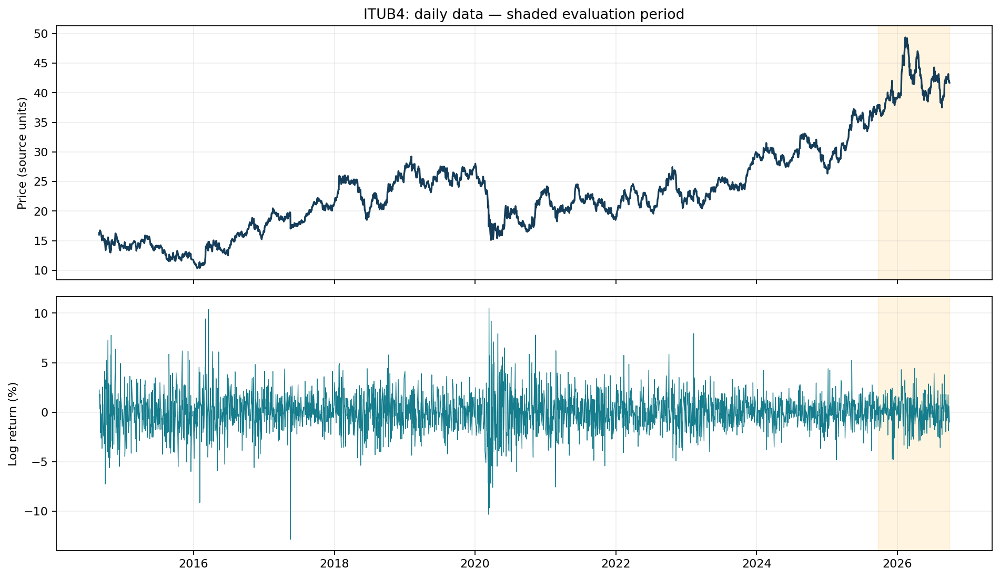
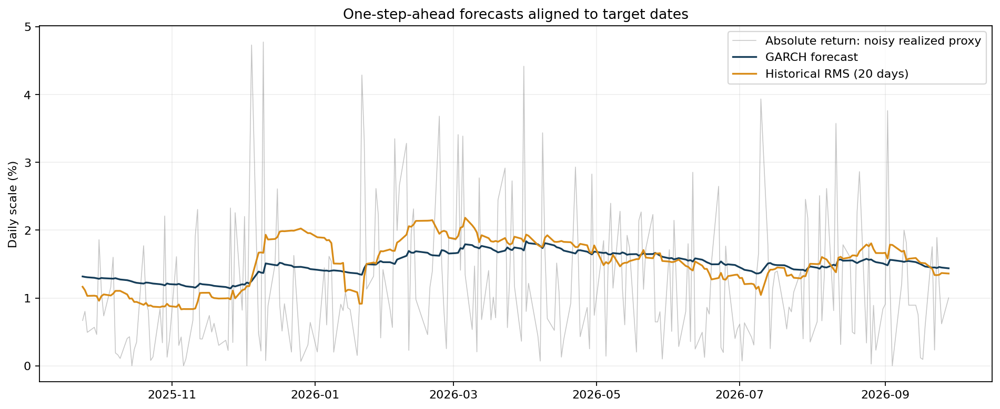
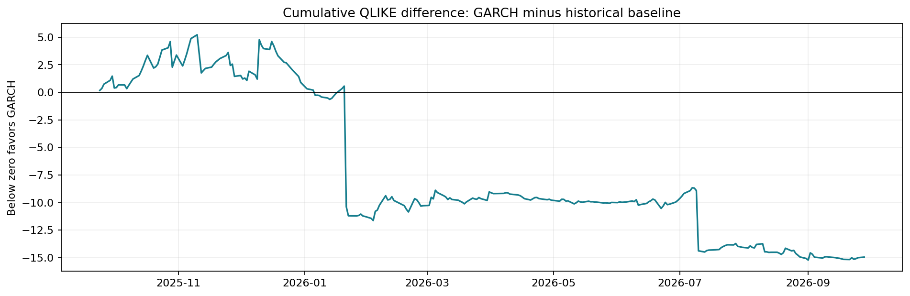
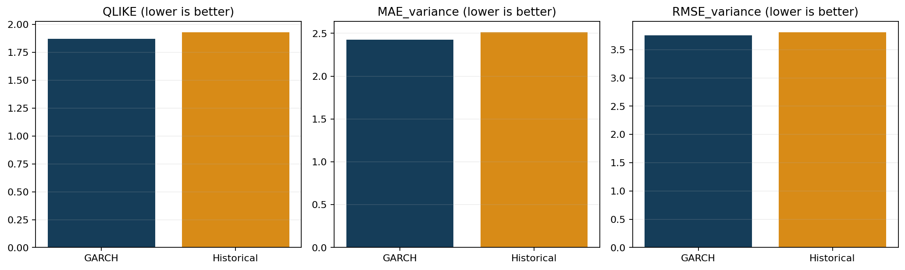

# GARCH: avaliação cronológica — ITUB4

Fonte: TradingView via tvDatafeed. Dados: 2014-08-28 a 2026-09-28.

## Método
GARCH(1,1), média zero e inovações Student-t, reestimado a cada observação com os últimos 1000 retornos. Horizonte: próximo pregão. Benchmark: média dos retornos ao quadrado nos últimos 20 pregões; sua raiz é uma volatilidade histórica RMS sob a hipótese de média zero. Ambos usam somente dados anteriores ao alvo. Retornos logarítmicos em porcentagem; variâncias em pontos percentuais ao quadrado.

O retorno diário ao quadrado é uma aproximação ruidosa da variância realizada, não a volatilidade verdadeira. QLIKE = log(h) + r²/h; menor é melhor. MAE e RMSE comparam variâncias. A avaliação usa as mesmas datas válidas para os dois modelos.

## Resultado calculado
                  n     QLIKE  MAE_variance  RMSE_variance
model                                                     
GARCH(1,1)-t    252  1.871578      2.428150       3.752267
Historical RMS  252  1.930916      2.513509       3.809354

GARCH apresentou menor QLIKE nesta amostra. Diferença GARCH − histórico: -0.059338. Isto é uma comparação descritiva, sem teste de significância ou garantia de superioridade futura.

Cobertura: 252/252 datas. Falhas: 0. Persistência >= 0,999: 0. Ajustes com avisos: 0.

## Limitações
- Sem otimização de parâmetros neste script. Alterar escolhas depois de observar resultados transforma este período em desenvolvimento; reserve um novo período futuro para confirmação.
- Dados históricos deste ativo podem já ter sido vistos em estudos anteriores. Esta avaliação é cronológica computacionalmente, mas não necessariamente um teste independente de toda pesquisa prévia.
- Não verifica automaticamente calendário oficial, ajustes por proventos/splits ou qualidade da série contínua de futuros. Revise quebras, lacunas e eventos corporativos.
- O dia atual é excluído conservadoramente. A disponibilidade histórica depende da fonte.
- Falhas são excluídas da comparação pareada e podem introduzir viés; consulte falhas.csv e cobertura.
- Este estudo avalia variância, não direção, acerto operacional ou rentabilidade.
- Figuras não constituem intervalos de confiança. Não há aqui auditoria completa de resíduos ou modelos alternativos.
- O snapshot é destinado à reprodução local; confirme permissões da fonte antes de redistribuí-lo.

## Figuras

